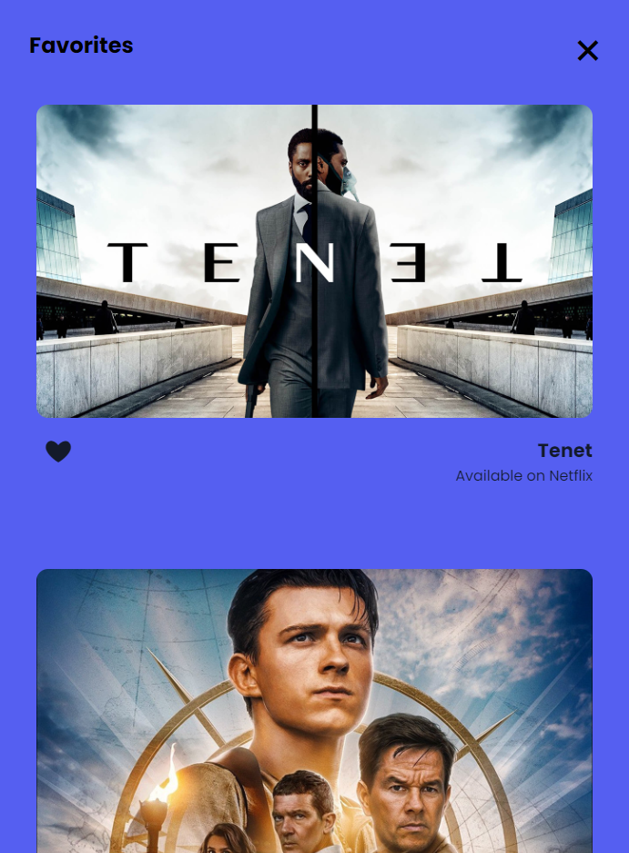

# Procesverslag
**Auteur:** Claudio Bakker

**De opdrachten:** [opdracht 1](opdracht1/index.html) en [opdracht 2](opdracht2/index.html)


<!-- Markdown is een simpele manier om HTML te schrijven.  
Markdown cheat cheet: [Hulp bij het schrijven van Markdown](https://github.com/adam-p/markdown-here/wiki/Markdown-Cheatsheet).

Nb. De standaardstructuur en de spartaanse opmaak van de README.md zijn helemaal prima. Het gaat om de inhoud van je procesverslag. Besteedt de tijd voor pracht en praal aan je website.

Nb. Door *open* toe te voegen aan een *details* element kun je deze standaard open zetten. Fijn om dat steeds voor de relevante stuk(ken) te doen. -->
## Bronnenlijst
* https://www.svgrepo.com/svg/3878/tree-silhouette
* https://codepen.io/shooft/pen/gOXgGMK
* https://codepen.io/shooft/pen/QWOdqEP
* https://codepen.io/shooft/pen/qBjXQmb

## Opdracht 1 plan

<details open>
  <summary>uitwerken na schetsen idee (voor week 2)</summary>


  ### Je storyboard:
  


  ### Je ambitie: 
  Aan deze technieken/punten wil ik werken:
  - Animatie skills met css
  - Ideeën omzetten in code
 
</details>


## Opdracht 1 reflectie

<details>
  <summary>uitwerken bij afronden opdracht (voor week 3)</summary>


  ### Je uitkomst - karakteristiek screenshot(s):
  
  
  
  
  
  
  


  ### Dit ging goed/Heb ik geleerd: 
  Ik heb tijdens het maken van deze opdracht geleerd te werken met keyframes. Ik had er wel eens over gelezen
  echter heb ik had ik het hiervoor nog niet op deze manier gebruikt. Mijn animatie begint met een boom die schudt,
  vervolgens vallen de letters van Apple uit de boom waarna het achtergrondscherm omhoog schuift. Vervolgens gaan de
  letters van Apple op de juiste plek staan maar staat de eerste letter nog scheef. Daarna rolt het logo van Apple
  richting de letters en botst tegen de eerste letter waardoor deze weer recht staat in plaats van schuin.

  Ook heb ik met mediaqueries het responsive gemaakt. De font-size is op een groter scherm groter, en het logo komt niet
  helemaal van buiten het scherm rollen maar fade in doormiddel van een opacity.

  Small screen:  
  
  

  Large screen:  
  
  


  ### Dit was lastig/Is niet gelukt:
  Ik vond het responsive maken redelijk ingewikkeld, dit kwam doordat ik de letters specifiek voor een screensize had gepositioneerd,
  echter uiteindelijk is dit toch gelukt.
  

</details>


## Opdracht 2 plan

<details>
  <summary>uitwerken na schetsen idee (voor week 4)</summary>
  Ik ga een Movie app page maken waarbij de gebruiker de mogelijkheid heeft om films op te zoeken via de zoekbalk, te filteren via categorieën en om 
  films te like zodat ze op je favorite-list komen te staan (waar je ze vervolgens ook weer kan verwijderen).

  ### Je ontwerp:
  


  ### Je ambitie: 
  Aan deze technieken/punten wil ik werken:
  - Hoe ik met Javascript items in een favorite-list kan zetten
  - Hoe ik doormiddel van Javascript op categorieën kan filteren
  - Hoe ik doormiddel van Javascript een werkende zoekbalk kan maken.
</details>


## Opdracht 2 test

<details>
  <summary>uitwerken na testen (week 6/7)</summary>

  Neem minimaal 5 bevindingen op:
  - De zoekfunctie werkt nog niet.
  - De Categorieën filter werkt wel
  - Het is nog niet helemaal responsive.
  - Ook is er nog geen light/dark modus feature aan de pagina toegevoegd.
  - Het toevoegen van films aan de favorite-list werkt ook nog niet helemaal.


  ### Bevinding 1:
  De zoekfunctie werkte nog niet helemaal doordat ik list.js niet goed werkend kreeg.
  #### oplossing:
  Uiteindelijk bleek het een fout in de link te zijn en heb ik ook de link in de body gezet in deze volgorde:

  ```javascript
  
  <script src="//cdnjs.cloudflare.com/ajax/libs/list.js/1.5.0/list.min.js"></script>

 <script src="https://hammerjs.github.io/dist/hammer.js"></script>

 <script src="./scripts/script.js"></script>
 ```


  ### Bevinding 2:
  Mijn pagina was nog niet helemaal responsive.

  #### oplossing:
  Ik heb dit opgelost door met mediaqueries de grid aan te passen zodat de layout van 1 column naar 2 columns ging, en op nog grotere schermen naar 3 columnen.
```css
  /* mediaqueries */

@media screen and (min-width: 480px) {
    ul:last-of-type  {
        margin: auto;
        max-width: 80em;
        display: grid;
        grid-template-columns: repeat(auto-fill, minmax(350px, 1fr));
        grid-template-rows: repeat(4, 350px);
        column-gap: 30px;
        row-gap: 1%;
        color: var(--light-clr);
    } 
    
}
```

Ook heb ik de searchbar samen met de categorie filters in het midden van de pagina gezet. Dit heb ik gedaan met de volgende code:

```css

/* searchbar */
/* Hier heb ik een text-align: center; waardoor de searchbar in het midden ging staan. */
  aside {
    top:0;
    padding: 1em;
    color: var(--light-clr);
    padding-top: 8em;
	  text-align: center;
  }


/* category filters */
/* Hier heb ik doormiddel van de padding de filters weten te centreren op de pagina. */
section:nth-of-type(2) {
    padding: 0 calc((100% - 33em) / 2);
    width: 100%;
}
```

En als laatst had ik een probleem met mijn list-items, namelijk dat als er maar 1 list item in de list stond vulde dit list-item de hele pagina. Dit bleek te komen omdat ik in de code van mijn grid in plaats van autofill, auto-fit had geschreven:
```css
grid-template-columns: repeat(auto-fit, minmax(350px, 1fr));
```
Juiste code:
```css
grid-template-columns: repeat(auto-fill, minmax(350px, 1fr));
```

  ### Bevinding 3:
  Er is nog geen light & darkmodus feature.

  #### oplossing:
  Dit heb ik opgelost door in de CSS een block aan te maken met userpreference: lightmode. Hier heb ik vervolgens de root ingezet met de juiste kleuren voor de lightmode.

  ```css
  :root {
  /* fonts */
  --main-font: 'Poppins', sans-serif;

    /* colors*/
  --main-clr: #151E2A;
  --light-clr: white;
	--header-font-clr: white;
  --secondary-clr:#464D57;
  --bright-clr: #555FF1;
	--bright-hover-clr: #262d96;
	--dark-clr: #000307;
	--grey-clr: #4F5E72;
	--grey-secondary-clr: #415269;
	--category-btn-font-clr: #151E2A;

}

/* switch naar lightmode als de gebruiker lightmode prefereert*/
@media (prefers-color-scheme: light) {

	:root {
		/* fonts */
		--main-font: 'Poppins', sans-serif;
	
		/* colors*/
		--main-clr: #ffffff;
		--light-clr: rgb(19, 26, 43);
		--header-font-clr: white;
		--secondary-clr:#464D57;
		--bright-clr: #555FF1;
		--bright-hover-clr: #262d96;
		--dark-clr: #202731;
		--grey-clr: #b3ccec;
		--grey-secondary-clr: #5b87c0;
		--category-btn-font-clr: white;

	}
	
}
  ```

  ### Bevinding 4:
  Het toevoegen van films aan de favorite-list werkte ook nog niet helemaal.

  #### oplossing:
  Dit heb ik opgelost door de Javascript te verbeteren en ervoor te zorgen dat als de user de film uit de favorieten lijst haalt, ook het hartje weer leeg wordt.

  ```javascript
  function removeFromWishlist(event){
  console.log(event.target)
  let li = event.target.closest("li");
  li.remove();
  var clickedHeart = event.target;
  let movieId = li.id;
  const movieFromList = document.getElementById(movieId);
  const heart = movieFromList.querySelector('button');
  console.log(movieFromList);
  
  
  if (clickedHeart.innerHTML == "♡") {
    /* het lege hartje vervangen door het hele hartje */
    clickedHeart.innerHTML = "&#10084;";
    heart.innerHTML = "&#10084;";
    
    /* het aria-label wijzigen van toevoegen naar verwijderen */
    clickedHeart.setAttribute("aria-label", "Remove from Favorites");
    
    /* en dan de functie aanroepen om de wishlist aan te passen */
    /* in dit geval moet er liefde bij */
    /* vandaar 'plus' */
    updateWishlist("plus");
  }
  else{
    
    // voeg hier toe dat nummers naast hartje verwijderd worden na klikken op hartje in wishlist
    
    /* het hartje vervangen door het gebroken hartje */
    heart.innerHTML = "♡";
     clickedHeart.innerHTML = "♡";
    
    
     /* het aria-label wijzigen van verwijderen naar toevoegen */
     clickedHeart.setAttribute("aria-label", "Add to Favorites");
     
     /* en dan de functie aanroepen om de love-list aan te passen */
     /* in dit geval moet er liefde af */
     /* vandaar 'min' */
     updateWishlist("min");
  }
  
}
  ```

</details>


## Opdracht 2 reflectie

<details>
  <summary>uitwerken bij afronden opdracht (voor week 8)</summary>

  ### Je uitkomst - karakteristiek screenshot(s):
  
  
  


  ### Dit ging goed/Heb ik geleerd: 
  De CSS ging erg goed. Ik heb zo de dark/lightmodus weten te implementeren, ook heb ik alles volledig responsive gekregen. Voor de layout heb ik weer Grid gebruikt omdat ik dit persoonlijk erg prettig vind werken samen met de mediaqueries.

  ### Dit was lastig/Is niet gelukt:
  Wat ik erg lastig vond was het werkend maken van de favoritelist. Dit kwam omdat ik uiteindelijk vast liep op het gedeelte waarbij de user een film uit de favorite-list heeft gehaald. Het hartje moest namelijk ook weer leeg worden. Uiteindelijk is dit me toch gelukt.

  Wat ik nog had kunne toevoegen was een blokje met de prefers-reduced motion zodat als de gebruiker geen animaties wilt, hij of zij deze ook niet te zien krijgt.

  /* Tone down the animation to avoid vestibular motion triggers like scaling or panning large objects. */
  ```css
  ul:first-of-type li:hover {
    transform: scale(1.05);
    transition: .2s ease;
    border-radius: 1em;
  }

  @media (prefers-reduced-motion) {
    ul:first-of-type li:hover {
      transform: none;
      transition: none;
      border-radius: 1em;
    }
  }
```
</details>

## Bronnen plaatjes:
* https://occ-0-2794-2219.1.nflxso.net/dnm/api/v6/6AYY37jfdO6hpXcMjf9Yu5cnmO0/AAAABf5f5yVG5-f8gVPv6UEcZIhWi3spr9D8FZF94ZFyeWM4I9RsAnHCabfCLkPWn-wPeFmtqF8UtHly1YP-ctR-Kn4J6t1Q.jpg?r=0fc
* https://occ-0-2794-2219.1.nflxso.net/dnm/api/v6/E8vDc_W8CLv7-yMQu8KMEC7Rrr8/AAAABVPBG1wPL8JFCJbvOPDVz3VUsKJZ0JTTAVu-hswC9XxJrtVY2FkqjEvFaGwUYXFYoHcbAytS3H-8jLCXL2Tr9XTRKYZw.jpg?r=555
* https://static1.colliderimages.com/wordpress/wp-content/uploads/2022/03/a-day-to-die.jpg
* https://prod-ripcut-delivery.disney-plus.net/v1/variant/disney/ECE88DB82DEDE7F05F7F6A569AD14F374BBA8E2ED5DF3C1E7A90B7DE74CD1CA8/scale?width=1200&aspectRatio=1.78&format=jpeg
* https://prod-ripcut-delivery.disney-plus.net/v1/variant/disney/FCC17C13922F4A9337B1B7BFEED17E749E09D60F975530834F1CE7D52655EAB9/scale?width=1200&aspectRatio=1.78&format=jpeg
* https://occ-0-2794-2219.1.nflxso.net/dnm/api/v6/6AYY37jfdO6hpXcMjf9Yu5cnmO0/AAAABYyyq7U1nmutk-K2UxMyO269jqVuyhlElg6-5flZxqqesfe51vOZf2GOAaSU50QfDWU5HSHyT0XzR7OMa0AWhiWJ0XL2.jpg?r=b81
* https://filmkrant.nl/wp-content/uploads/2022/03/Texas-Chainsaw-Massacre-1-1000x563.jpg
* https://occ-0-2794-2219.1.nflxso.net/dnm/api/v6/E8vDc_W8CLv7-yMQu8KMEC7Rrr8/AAAABc4jUQoe5XJbz8b2fISsL-gVPDHnqecmUlmj1wFLbB_jDRVrso8JzlB1kvLdjzR0aHSOhBCpJcOKOj3TgiDUsw4ICIYY.jpg?r=426
* https://static1.colliderimages.com/wordpress/wp-content/uploads/2022/01/fistful-of-vengeance-social-featured.jpg
* https://ultimateactionmovies.com/wp-content/uploads/2022/01/The-Commando.jpg
* https://image.tmdb.org/t/p/w780//uQUquwEvPuCg0ACRxU5NiCGgJLN.jpg
* https://sm.ign.com/ign_nl/gallery/c/charting-t/charting-the-uncharted-movies-long-road-through-development_y3kz.jpg
* https://www.netflix-nederland.nl/wp-content/uploads/2018/03/Deep-Water-Netflix-810x456.jpg
* https://prod-ripcut-delivery.disney-plus.net/v1/variant/disney/61671BB158CB1E7F60139A7E6D9F51547F047AD217DA790E2100BDA0B62D1F91/scale?width=1200&aspectRatio=1.78&format=jpeg
* https://is3-ssl.mzstatic.com/image/thumb/Video123/v4/30/ee/74/30ee74ad-ed65-6435-7522-94ab193468af/SPE_JUMANJI_THE_NEXT_LEVEL_TH_FINAL_WW_ARTWORK_EN_EN-US_3840x2160_20O14H00000EO8.lsr/1200x675.jpg
* https://www.exberliner.com/wp-content/uploads/2022/01/the-kings-man-1.jpg
* https://www.ommercato.com/wp-content/uploads/2022/03/stx-places-chris-pine-ben-foster-movie-the-contractor-in-bankruptcy.png
* https://i.ytimg.com/vi/Et5Cgq1B2_g/maxresdefault.jpg
* https://static01.nyt.com/images/2021/11/12/arts/rednotice1/merlin_197230743_4fa6104e-b0ff-448f-85b1-4a696b944a63-superJumbo.jpg
* https://images.pathe-thuis.nl/28589_1920x1080.jpg
* https://images0.persgroep.net/rcs/k5nR0jotec-_g4G41k-Zub0JQgc/diocontent/203586491/_fitwidth/763?appId=93a17a8fd81db0de025c8abd1cca1279&quality=0.8
* https://images0.persgroep.net/rcs/YAOMD2jpr0fZPxQaGKj2BU6oonk/diocontent/204077122/_fitwidth/1240?appId=93a17a8fd81db0de025c8abd1cca1279&quality=0.9
* https://redcapes.it/wp-content/uploads/2021/11/ResidentE.jpg
* https://www.geekish.nl/wp-content/uploads/2020/09/tenet1.jpg
